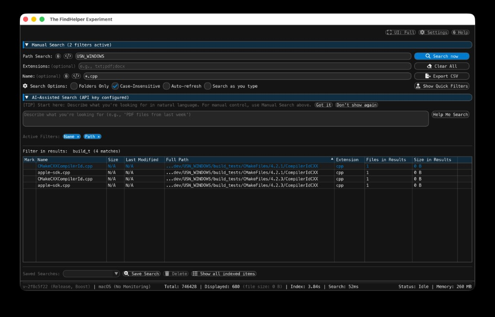
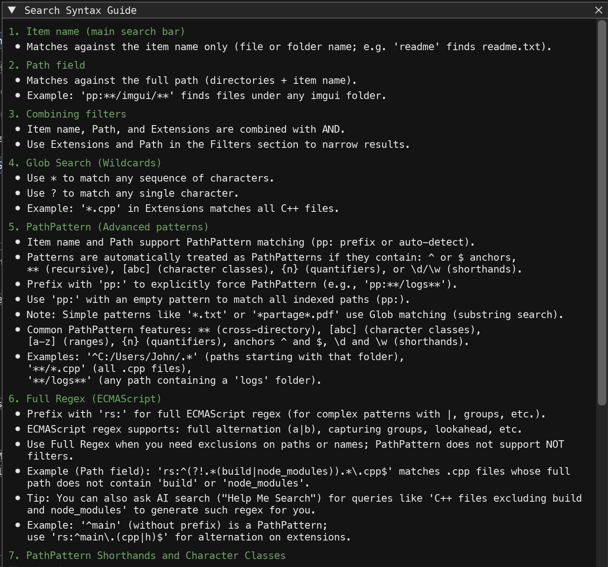

# FindHelper

[](https://github.com/BrunoO/FindHelper/actions/workflows/build.yml)

A cross-platform file search application with a modern GUI built using ImGui and AI-powered assistance. Index a folder, search by name/pattern/extension, filter by size or date, and view results in a table—with optional AI-assisted search.





## About This Project

This repository is my **personal playground for learning how to code with AI agents**. I use it to explore and improve my workflow with AI-assisted development—mainly **Cursor**, **Jules**, and **Claude Code**—while building a real application. The goal is to get hands-on experience with pair programming, prompt design, and keeping code quality high when AI suggests changes. If you’re curious about AI-assisted C++ development or want to see how one project evolves with that workflow, you’re in the right place.

**What this project is:** An experiment in building software by **dialoguing with AI assistants in natural language**—no hand-written implementation plans, just prompts and conversation. I try to strike a balance between giving the agents room to work and enforcing guardrails (coding standards, design rules, tests, reviews) so that quality stays high. Despite those efforts, this remains experimental: **flaws or bugs may have slipped through**, and the codebase may carry trade-offs that a traditional development process would have avoided. Use or contribute with that in mind.

**Optional: AI search** — The app can use Google’s Gemini API to turn natural-language descriptions into search configs; set the `GEMINI_API_KEY` environment variable to enable it (core search works without any API key).

## Supported Platforms

- **Windows** (primary target) – DirectX 11 + GLFW
- **macOS** – Metal + GLFW
- **Linux** – OpenGL 3 + GLFW

---

## Drive Modifications

FindHelper is designed primarily as a search and discovery tool and **mostly does not modify your drive**. However, it performs specific write operations when explicitly requested by the user:

- **Deleting Files**: Moving files or folders to the Recycle Bin (Windows) or Trash (macOS/Linux).
- **Saving Settings**: Application preferences are saved to a `settings.json` file in the user's profile.
- **Exporting Results**: Search results can be exported to a CSV file at a location you choose.
- **Drag and Drop**: Initiating a shell drag-and-drop operation can move or copy files to other folders or applications.
- **Quick Access Pinning**: (Windows only) Pinning a file or folder to the Windows Explorer Quick Access.
- **Logging**: Application logs are written to `FindHelper.log` in the system's temporary or cache directory for troubleshooting.
- **Index Dumping**: The full index of paths can be dumped to a text file using the `--dump-index-to` command-line argument.

---

## Prerequisites

### All Platforms

1. **Git** (with submodule support)
2. **CMake** 3.16 or newer
3. **C++17 compatible compiler**

### Windows

- **Visual Studio 2019+** with C++ Desktop workload
- Use the **Developer Command Prompt** or **Developer PowerShell** for building
- **GLFW** is provided by CMake (fetched or pre-built); no separate install needed
- **Boost** (optional, for `FAST_LIBS_BOOST`): Download from [boost.org](https://www.boost.org/) and set `BOOST_ROOT`, or use **vcpkg**: install Boost (e.g. `vcpkg install boost` or a minimal set: `boost-headers boost-unordered boost-regex boost-lockfree`), then configure with `-DCMAKE_TOOLCHAIN_FILE=<path-to-vcpkg>/scripts/buildsystems/vcpkg.cmake -DFAST_LIBS_BOOST=ON`

### macOS

- **Xcode Command Line Tools**: `xcode-select --install`
- **GLFW** (optional): `brew install glfw` – CMake will download it automatically if not found

### Linux

For detailed build instructions, see [Building on Linux](docs/guides/building/BUILDING_ON_LINUX.md).

---

## First Time Setup

This project uses **Git Submodules** for dependencies. Initialize them before building:

```bash
git submodule update --init --recursive
```

This downloads:
- `external/imgui` – Dear ImGui library
- `external/doctest` – Unit testing framework
- `external/nlohmann_json` – JSON library
- `external/freetype` – FreeType (font rendering)
- `external/imgui_test_engine` – ImGui Test Engine (optional; used when building with `ENABLE_IMGUI_TEST_ENGINE=ON`)

---

## Building with CMake

### Windows

From the **Developer Command Prompt for Visual Studio**:

```powershell
# Configure (explicit x64 for AVX2 support)
cmake -S . -B build -A x64

# Build Release
cmake --build build --config Release

# Build Debug
cmake --build build --config Debug
```

**Example: Build with Boost and PGO enabled:**

```powershell
cmake -S . -B build -A x64 -DFAST_LIBS_BOOST=ON -DBOOST_ROOT=C:\dev\boost_1_90_0 -DBoost_DIR=C:\dev\boost_1_90_0\lib64-msvc-14.1\cmake\Boost-1.90.0 -DENABLE_PGO=ON -DRUN_TESTS_AFTER_BUILD=OFF && cmake --build build --config Release
```

> **Note:** The `-A x64` flag ensures 64-bit build with AVX2 optimizations. Without it, CMake may default to 32-bit on some systems.

The executable will be at `build\Release\FindHelper.exe` or `build\Debug\FindHelper.exe`.

### macOS

```bash
# Configure (Release; explicit OFF so test engine stays off even if cache had ON)
cmake -S . -B build -DCMAKE_BUILD_TYPE=Release -DENABLE_IMGUI_TEST_ENGINE=OFF

# Build Release
cmake --build build --config Release

# Build Debug
cmake -S . -B build -DCMAKE_BUILD_TYPE=Debug -DENABLE_IMGUI_TEST_ENGINE=OFF
cmake --build build --config Debug
```

The app bundle will be at `build/FindHelper.app`. If you previously configured with the test engine ON, pass `-DENABLE_IMGUI_TEST_ENGINE=OFF` as above (or remove the `build` directory and reconfigure) so the normal app build does not include it.

### Linux

See [Building on Linux](docs/guides/building/BUILDING_ON_LINUX.md) for instructions.

---

## Running the app

After building, run the application:

- **Windows:** `build\Release\FindHelper.exe` (or `build\Debug\FindHelper.exe` for Debug). On first run, choose a folder to index.
- **macOS:** Open `build/FindHelper.app` (or run the executable inside it). On first run, choose a folder to index.
- **Linux:** Run the `FindHelper` binary from your build directory (e.g. `./build/FindHelper`). On first run, choose a folder to index.

### Command-line arguments

You can pass the following options when starting the app. Run with `--help` (or `-h`) to see the same list in the terminal.

| Option | Description |
|--------|--------------|
| `-h`, `--help`, `-?` | Show help message and exit |
| `-v`, `--version` | Show version information and exit |
| `--show-metrics` | Show Metrics button and window (for power users / debugging) |
| `--thread-pool-size=<n>` | Override thread pool size (0=auto, 1–64) |
| `--load-balancing=<strategy>` | Override load balancing strategy (`static`, `hybrid`, `dynamic`, `interleaved`; `work_stealing` when built with Boost) |
| `--window-width=<n>` | Override initial window width (640–4096) |
| `--window-height=<n>` | Override initial window height (480–2160) |
| `--dump-index-to=<file>` | Save all indexed paths to file (one per line) |
| `--index-from-file=<file>` | Populate index from a text file (one path per line) |
| `--crawl-folder=<path>` | Folder to crawl and index (alternative to USN Journal on Windows; required on macOS/Linux if no index file) |
| `--win-volume=<volume>` | Override volume to monitor (e.g. `D:`). **Windows only**; default is `C:` |
| `--run-imgui-tests-and-exit` | Run all ImGui Test Engine tests and exit. Requires a build with `ENABLE_IMGUI_TEST_ENGINE=ON` |

For **Profile-Guided Optimization (PGO)** on Windows, see [Profile-Guided Optimization (Windows Only)](#profile-guided-optimization-windows-only) for `--pgo-profile` and `--pgo-duration=<ms>`.

---

## Running Unit Tests

Unit tests are built by default using [doctest](https://github.com/doctest/doctest).

### Build and Run Tests

#### Windows (Visual Studio Generator)

On Windows, you **must** specify the configuration (`Debug` or `Release`) when running ctest:

```bash
# Build all test executables (Debug)
cmake --build build --config Debug

# Run tests using CTest (must specify -C Debug or -C Release)
cd build
ctest -C Debug --output-on-failure
```

Or for Release configuration:

```bash
cmake --build build --config Release
cd build
ctest -C Release --output-on-failure
```

#### macOS / Linux

```bash
# Build all test executables
cmake --build build --config Release

# Run tests using CTest
cd build
ctest --output-on-failure
```

#### Convenience Target (All Platforms)

Or run the convenience target:

```bash
cmake --build build --target run_tests
```

**Note:** On Windows, the `run_tests` target will use the configuration specified during build.

### macOS: Build Script

On macOS, use the provided script to build and run tests:

```bash
scripts/build_tests_macos.sh
```

### Test Executables

The following test executables are built:

| Test | Description |
|------|-------------|
| `string_search_tests` | Core string search API |
| `string_search_avx2_tests` | AVX2 string search integration |
| `string_search_neon_tests` | ARM NEON string search integration |
| `cpu_features_tests` | CPU feature detection |
| `path_utils_tests` | Path utility functions |
| `path_pattern_matcher_tests` | Path pattern matching |
| `path_pattern_integration_tests` | Pattern matcher integration |
| `path_operations_tests` | Path operations (resolve, normalize) |
| `simple_regex_tests` | Simple regex implementation |
| `std_regex_utils_tests` | std::regex utilities |
| `search_pattern_utils_tests` | Search pattern parsing and prefix handling |
| `string_utils_tests` | String utility functions |
| `file_system_utils_tests` | File system utilities |
| `directory_resolver_tests` | Directory resolution |
| `lazy_attribute_loader_tests` | Lazy attribute loading and caching |
| `parallel_search_engine_tests` | Parallel search engine |
| `file_index_search_strategy_tests` | Load balancing strategies |
| `file_index_maintenance_tests` | File index maintenance |
| `index_operations_tests` | File index operations |
| `search_context_tests` | Search context (query, filters) |
| `streaming_results_collector_tests` | Streaming results collection |
| `search_result_sort_tests` | Search result sorting |
| `time_filter_utils_tests` | Time filtering utilities |
| `gui_state_tests` | GUI state management |
| `settings_tests` | Settings persistence and loading |
| `gemini_api_utils_tests` | Gemini API utilities |
| `total_size_computation_tests` | Total size computation |
| `incremental_search_state_tests` | Incremental search state |

### Disable Tests

To skip building tests (faster configuration):

```bash
cmake -S . -B build -DBUILD_TESTS=OFF
```

---

## Building with ImGui Test Engine

The project can be built with the [Dear ImGui Test Engine](https://github.com/ocornut/imgui_test_engine) for in-process UI tests. When enabled, the app shows a test engine window where you can browse and run UI tests interactively.

**Platform:** The test engine integration is currently supported on **macOS**; Windows and Linux support may be added later.

### Prerequisites

1. **Submodule:** Ensure the `imgui_test_engine` submodule is present (it is included by `git submodule update --init --recursive`).
2. **CMake option:** Configure with `ENABLE_IMGUI_TEST_ENGINE=ON`.

### Build with Test Engine (macOS)

```bash
# From project root: configure with test engine enabled
cmake -S . -B build -DCMAKE_BUILD_TYPE=Release -DENABLE_IMGUI_TEST_ENGINE=ON

# Build the app
cmake --build build --config Release
```

The app bundle is at **`build/FindHelper.app`**.

### Run the App with Test Engine

Start the app so the test engine window is available:

```bash
# Open the app bundle (macOS)
open build/FindHelper.app
```

Or run the executable directly:

```bash
build/FindHelper.app/Contents/MacOS/FindHelper
```

### Running ImGui Test Engine Tests

1. **Start the app** (see [Run the App with Test Engine](#run-the-app-with-test-engine)).
2. **Open the test engine window** — it appears when the app runs with the test engine enabled.
3. **Run tests** — in the test engine window, select a test (e.g. a smoke test under a category) and run it. Tests execute in-process and report pass/fail in the UI.

These are **UI tests** driven by the test engine (not the same as the doctest-based unit tests run via `ctest`). Unit tests still use the instructions in [Running Unit Tests](#running-unit-tests).

**Regression tests** (search result counts against golden data) require the std-linux-filesystem index. Run the app with that index, then run the regression tests from the test engine UI:

```bash
build/FindHelper.app/Contents/MacOS/FindHelper --index-from-file=tests/data/std-linux-filesystem.txt
```

> **Note:** `tests/data/std-linux-filesystem.txt` is a large test dataset not included in this repository. An alternative dataset or generation script will be provided in a future update.

### Optional: Unit Tests with Same Config

To run the **doctest unit tests** using the same CMake config (the test engine only affects the app target):

```bash
cmake -S . -B build -DCMAKE_BUILD_TYPE=Release -DENABLE_IMGUI_TEST_ENGINE=ON
cmake --build build --config Release
ctest --test-dir build -C Release
```

### Disable Test Engine

The default build has the test engine **OFF**. To explicitly disable it:

```bash
cmake -S . -B build -DENABLE_IMGUI_TEST_ENGINE=OFF
```

---

## CMake Options

| Option | Default | Description |
|--------|---------|-------------|
| `BUILD_TESTS` | `ON` | Build unit tests |
| `RUN_TESTS_AFTER_BUILD` | `OFF` | Auto-run tests after build |
| `TEST_VERBOSE_OUTPUT` | `OFF` | Show detailed test output |
| `ENABLE_IMGUI_TEST_ENGINE` | `OFF` | Build with ImGui Test Engine for in-process UI tests (macOS) |
| `IMGUI_TEST_ENGINE_INSTALL_CRASH_HANDLER` | `ON` | When test engine is ON: install default crash handler in-app (set OFF at build time for CI or custom handler). No runtime flag. |
| `FAST_LIBS_BOOST` | `OFF` | Use Boost (unordered_map, regex, lockfree; requires Boost 1.80+) |
| `ENABLE_MFT_METADATA_READING` | `OFF` | Read file size/mod time from MFT during initial population (Windows only) |
| `ENABLE_PGO` | `OFF` | Enable Profile-Guided Optimization (Windows only) |

Example:

```bash
cmake -S . -B build -DBUILD_TESTS=ON -DTEST_VERBOSE_OUTPUT=ON
```

---

## Profile-Guided Optimization (Windows Only)

For maximum performance on Windows, you can enable PGO:

**1. Build instrumented version (MUST specify Release configuration):**

```powershell
# ⚠️ IMPORTANT: Always specify Release configuration explicitly to avoid D9002 warnings
cmake -S . -B build -DENABLE_PGO=ON -DCMAKE_BUILD_TYPE=Release
cmake --build build --config Release
```

> **Troubleshooting D9002 warnings:** If you get "ignoring /GENPROFILE", ensure /GENPROFILE is only used in linker options and both steps use Release configuration. See [PGO Setup](docs/guides/building/PGO_SETUP.md) for more details.

**2. Generate profile data (with automatic workload):**

```powershell
# Run in profiling mode for 30 seconds (default, auto-crawls and exits)
.\build\Release\FindHelper.exe --pgo-profile

# Or with custom duration (e.g., 60 seconds)
.\build\Release\FindHelper.exe --pgo-profile --pgo-duration=60000

# Or with specific folder to crawl for more realistic data
.\build\Release\FindHelper.exe --pgo-profile --crawl-folder=C:\
```

**3. Merge profile data (with verbose output):**

```powershell
cd build\Release
# /summary = per-function stats, /detail = detailed coverage info
pgomgr /merge /summary /detail FindHelper*.pgc FindHelper.pgd
cd ..\..
```

**4. Reconfigure and rebuild (with profile data):**

```powershell
# Reconfigure (same Release configuration)
cmake -S . -B build -DENABLE_PGO=ON -DCMAKE_BUILD_TYPE=Release

# Build optimized version
cmake --build build --config Release
```

The resulting `FindHelper.exe` is the PGO-optimized binary with 10-20% performance improvement.

> **Complete workflow details:** See [PGO Setup](docs/guides/building/PGO_SETUP.md).

---

## Project Structure

```
USN_WINDOWS/
├── src/                # Application source (core, UI, platform, search, etc.)
├── tests/              # Unit tests (doctest-based)
├── external/           # Git submodules (imgui, doctest, nlohmann_json, freetype)
├── scripts/            # Build / tooling scripts
├── docs/               # Public contributor-facing docs
├── internal-docs/      # Internal & historical docs (not published in OSS repo)
├── resources/          # Icons and application resources
├── CMakeLists.txt      # CMake build configuration
└── README.md           # This file
```

---

## Additional Documentation

Full index: [docs/DOCUMENTATION_INDEX.md](docs/DOCUMENTATION_INDEX.md).

- **Linux Build Details**: `docs/guides/building/BUILDING_ON_LINUX.md`
- **Naming Conventions**: `docs/standards/CXX17_NAMING_CONVENTIONS.md`
- **Design Overview**: `docs/design/ARCHITECTURE_COMPONENT_BASED.md`

Contributions are welcome; see the index above and [AGENTS.md](AGENTS.md) for coding and contribution guidelines.

---

## Adding new features

The project is developed with an AI-assisted workflow. The coding rules and quality guardrails are in [AGENTS.md](AGENTS.md). For contributors using AI agents (Cursor, Claude Code, etc.):

- **Before implementing:** write a spec using [specs/SPECIFICATION_DRIVEN_DEVELOPMENT_PROMPT.md](specs/SPECIFICATION_DRIVEN_DEVELOPMENT_PROMPT.md) to get clear requirements, acceptance criteria, and a phased task breakdown before any code is written.
- **During implementation:** follow [AGENTS.md](AGENTS.md) for all code quality rules (C++17, naming, platform guards, clang-tidy/Sonar, Windows compatibility).
- **For any change touching function signatures, threading, or platform `#ifdef` blocks:** perform impact analysis before editing — identify all call sites, trace data flow, verify platform intent, and run the relevant tests after.

See [docs/DOCUMENTATION_INDEX.md](docs/DOCUMENTATION_INDEX.md) for the full contributor docs index.

---

## Troubleshooting

### macOS: “FindHelper.app is damaged and can’t be opened”

If you **downloaded** the app from a GitHub release (zip) and macOS says the app is damaged, it’s almost always **Gatekeeper** blocking an unsigned app that came from the internet (quarantine attribute), not real file damage.

**Fix:** In Terminal, remove the quarantine attribute from the app (use your actual path if different):

```bash
xattr -cr FindHelper.app
```

Then open the app as usual. Only do this for apps you trust (e.g. official GitHub releases from this repo).

### Submodules Missing

If build fails with missing files in `external/`:

```bash
git submodule update --init --recursive
```

### GLFW Not Found (macOS/Linux)

CMake will automatically download GLFW 3.4 if not installed. To install system GLFW:

- **macOS**: `brew install glfw`
- **Ubuntu**: `sudo apt-get install libglfw3-dev`

### Font Issues on Linux

Ensure fontconfig is installed:

```bash
sudo apt-get install libfontconfig1-dev
fc-list : family | head -5  # Verify fonts are discoverable
```

### OpenGL Context Fails (Linux)

Ensure Mesa is installed and a display server is running:

```bash
glxinfo | grep "OpenGL version"  # Requires mesa-utils
```

---

## License

This project is licensed under the MIT License – see the [LICENSE](LICENSE) file for details. To report security issues, see [SECURITY.md](SECURITY.md).

## Credits

Third-party libraries and design references (themes, fonts) are listed in [CREDITS.md](CREDITS.md) with their respective licenses.
