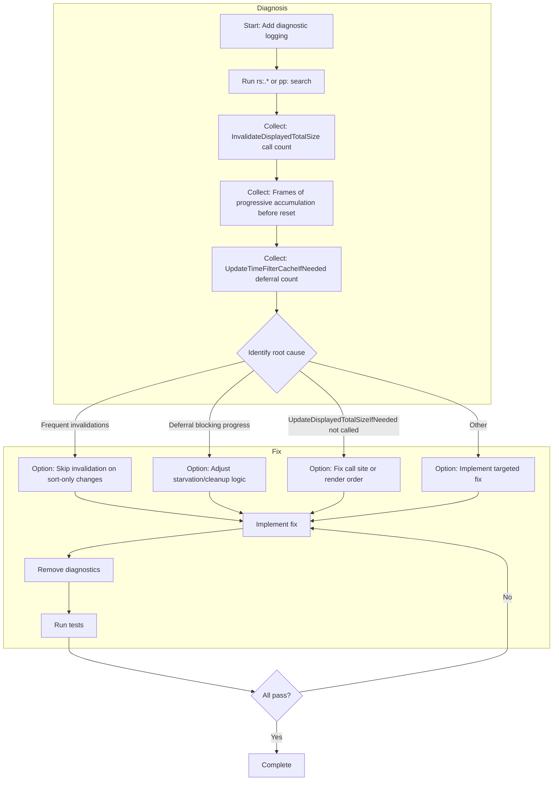

# Agent Task: Determine and Fix Root Cause of Missing Total Size in Status Bar for Full-Index Searches

---

## Mission Context

When users run full-index searches (e.g. `rs:.*` or `pp:`) that display the entire index, the status bar never shows the total size of displayed results. Partial searches (smaller result sets) work correctly. Several fixes have been applied (time-based starvation guard, reset-before-mutate ordering, increased per-frame budget from 50 to 100) but the issue persists. The agent must diagnose the root cause and implement a fix.

## Core Objective

Identify why `displayedTotalSizeValid` never becomes `true` for full-index searches, and implement a fix so the status bar shows total size (e.g. "Displayed: 100000 (1.2 GB)") when displaying full-index content.

## Desired Outcome

- Total size appears in the status bar for full-index searches (`rs:.*`, `pp:`) within a reasonable time (e.g. under 30 seconds for 100k results).
- Partial searches continue to work as before.
- No regressions in filter cache behavior, sorting, or cloud file handling.

## Visual Workflow

## The Process / Workflow

### Phase 1: Add Diagnostic Logging (Temporary)

1. Add temporary counters/logging in `SearchResultUtils.cpp` and `SearchResultsService.cpp`:
   - Count how many times `InvalidateDisplayedTotalSize` is called during a single `rs:.*` search (from search start until user stops or 60 seconds elapse).
   - Count how many frames `UpdateDisplayedTotalSizeIfNeeded` runs progressive accumulation before being reset (i.e. before `idx` and `acc` are reset to 0).
   - Count how often `UpdateTimeFilterCacheIfNeeded` returns early due to the time-based deferral (when `total_size_in_progress` and `now - s_last_cleanup < kMinCleanupInterval`).
2. Use `LOG_INFO_BUILD` or similar (see `utils/Logger.h`) so logs appear in debug builds. Log a summary every N seconds or when search completes.
3. Run the application, execute `rs:.*` or `pp:` with a large index, and capture the diagnostic output.

### Phase 2: Analyze and Identify Root Cause

4. From the diagnostics, determine:
   - **If invalidations are frequent:** Something is calling `InvalidateDisplayedTotalSize` repeatedly. Trace call sites: `HandleTableSorting`, `CheckAndCompleteAsyncSort` (SearchResultsService.cpp), `CleanUpCloudFutures`, `UpdateTimeFilterCacheIfNeeded` rebuild (SearchResultUtils.cpp), and SearchController (on search state changes).
   - **If sort triggers invalidation:** The table has default sort (e.g. Size column with `PreferSortDescending`). On first frame, `SpecsDirty` may be true, triggering async sort. When sort completes, `CheckAndCompleteAsyncSort` calls `InvalidateDisplayedTotalSize`. The total size is invariant under reordering—invalidating on sort-only changes may be unnecessary and causes perpetual restart.
   - **If deferral is excessive:** The 250 ms starvation guard may still block progress if cleanup runs and invalidates every 250 ms.
   - **If `UpdateDisplayedTotalSizeIfNeeded` is never or rarely called:** Check render order. StatusBar calls it in `RenderDisplayedCountAndSize`. ResultsTable calls it after `HandleTableSorting` via `UpdateFilterCaches`. Ensure both run when we have complete results and no filters.
5. Document the identified root cause in a brief comment or in `internal-docs/analysis/2026-02-14_FULL_INDEX_TOTAL_SIZE_ANALYSIS.md`.

### Phase 3: Implement Fix

6. Implement the fix based on the root cause:
   - **For sort-triggered invalidations:** Consider skipping `InvalidateDisplayedTotalSize` in `HandleTableSorting` and `CheckAndCompleteAsyncSort` when only the sort order changed (same underlying result set). The total size does not change when reordering. Ensure filter cache rebuild still occurs; only avoid resetting progressive total-size state when the displayed set is unchanged.
   - **For other causes:** Apply a targeted fix (e.g. adjust when deferral runs, ensure `UpdateDisplayedTotalSizeIfNeeded` is called from the right place, or fix a logic bug in `display_results` selection).
7. Remove all temporary diagnostic logging added in Phase 1.

### Phase 4: Verify

8. Run `scripts/build_tests_macos.sh` and ensure all tests pass.
9. Manually verify: run `rs:.*` or `pp:` with a large index; confirm total size appears in the status bar within a reasonable time.
10. Verify partial searches still show total size correctly.

## Anticipated Pitfalls

- **Do not** remove `InvalidateDisplayedTotalSize` when the underlying result set actually changes (e.g. filter rebuild, new search results). Only consider skipping it when only sort order changed.
- **Do not** break the filter cache logic. `UpdateTimeFilterCacheIfNeeded` and `UpdateSizeFilterCacheIfNeeded` must still invalidate when the displayed set changes.
- **Do not** assume `deferFilterCacheRebuild` is the issue without evidence. For no-filter cases, `UpdateSizeFilterCacheIfNeeded` clears it when called from `UpdateFilterCaches` (ResultsTable).
- **Watch for** `EnsureSizeLoaded` modifying `result` through `const SearchResult&`—this may rely on `mutable` or similar. Do not change that without verifying.
- **Watch for** render order: StatusBar renders after ResultsTable. Both call `UpdateDisplayedTotalSizeIfNeeded`. Ensure the logic is correct for the no-filter path.

## Acceptance Criteria / Verification Steps

- [ ] Root cause is identified and documented.
- [ ] Fix is implemented and all temporary diagnostics are removed.
- [ ] `scripts/build_tests_macos.sh` passes.
- [ ] Manual test: `rs:.*` or `pp:` with large index shows total size in status bar.
- [ ] Manual test: Partial search still shows total size.
- [ ] No new linter errors or SonarQube issues.
- [ ] Changes follow AGENTS.md (naming, const correctness, C++17, etc.).

## Strict Constraints / Rules to Follow

- Follow all rules in `AGENTS.md` (platform-specific code, naming, RAII, etc.).
- Use C++17 only; no newer language features.
- Do not modify platform-specific `#ifdef` blocks to make code cross-platform.
- Run `scripts/build_tests_macos.sh` to validate; do not invoke cmake/make directly.
- Do not add `InvalidateDisplayedTotalSize` in new places without justification.
- Preserve the existing behavior for filtered results (time filter, size filter) and cloud files.

## Context and Reference Files

- **Primary:** `src/search/SearchResultUtils.cpp` – `UpdateDisplayedTotalSizeIfNeeded`, `UpdateTimeFilterCacheIfNeeded`, `CleanUpCloudFutures`, `kDisplayedTotalSizeLoadsPerFrame`
- **Primary:** `src/search/SearchResultsService.cpp` – `HandleTableSorting`, `CheckAndCompleteAsyncSort`, `UpdateFilterCaches`
- **Primary:** `src/ui/StatusBar.cpp` – `RenderDisplayedCountAndSize`, call to `UpdateDisplayedTotalSizeIfNeeded`
- **Primary:** `src/ui/ResultsTable.cpp` – `UpdateFilterCaches` call, `HandleTableSorting` call, `UpdateDisplayedTotalSizeIfNeeded` call after sort
- **Reference:** `src/gui/GuiState.h` – `InvalidateDisplayedTotalSize`, `ResetDisplayedTotalSizeProgress`, `displayedTotalSizeValid`, `displayedTotalSizeComputationIndex`, `displayedTotalSizeComputationBytes`
- **Reference:** `internal-docs/analysis/2026-02-14_FULL_INDEX_TOTAL_SIZE_ANALYSIS.md` – prior analysis and hypotheses
- **Reference:** `AGENTS.md` – project rules and conventions

## Concluding Statement

Proceed with the task. Start with Phase 1 (diagnostics), use the data to identify the root cause in Phase 2, implement the fix in Phase 3, and verify in Phase 4. Document findings and update the analysis document as needed.
