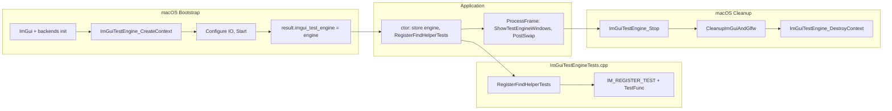

# Specification: ImGui Test Engine Integration (macOS-first, Single Test Harness)

**Feature:** Integrate the official Dear ImGui Test Engine into the FindHelper app so that in-process UI tests can run. Initial scope: get the harness in place on **macOS** with a **single simple test**; no regression to existing behavior; test engine code isolated behind `#ifdef ENABLE_IMGUI_TEST_ENGINE` and test registration/helpers in a separate file.

**Date:** 2026-02-20  
**Status:** Draft  
**References:** `specs/SPECIFICATION_DRIVEN_DEVELOPMENT_PROMPT.md`, `AGENTS.md`, `internal-docs/prompts/AGENT_STRICT_CONSTRAINTS.md`, `docs/analysis/2026-02-19_IMGUI_TEST_ENGINE_INTEGRATION_STEPS.md`

---

## Step 1 — Requirements summary and assumptions

### Scope

- **Primary goal:** Get the ImGui Test Engine **harness** working on **macOS** so that:
  - The app can be built with an optional `ENABLE_IMGUI_TEST_ENGINE` CMake option (default OFF).
  - When enabled on macOS, the test engine is created after ImGui/backends init, started, and used in the main loop (PostSwap; show test engine windows).
  - One **simple registered test** runs successfully (e.g. “launch” test that sets ref to main window and yields).
  - The test engine window is visible so the user can browse and run tests interactively.
- **Out of scope for this spec:** Windows and Linux integration (lower priority; to be addressed in further user stories). A complete UI test suite or many tests (covered by future specs). Perf tool / ImPlot (optional, not required for harness).
- **Non-goals:** No external tools (e.g. Python); no OS-level input simulation; no change to app behavior when the test engine is **disabled** (default build).

### Functional requirements

| ID | Requirement |
|----|-------------|
| R1 | When `ENABLE_IMGUI_TEST_ENGINE` is OFF, the app builds and runs exactly as today; no new code paths, no new symbols in the default target. |
| R2 | When `ENABLE_IMGUI_TEST_ENGINE` is ON and the platform is macOS, the app creates the test engine after ImGui backends are initialized, starts it, and calls `ImGuiTestEngine_PostSwap` and `ImGuiTestEngine_ShowTestEngineWindows` each frame. |
| R3 | All test engine usage (creation, configuration, start, stop, destroy, registration, frame calls) is guarded by `#ifdef ENABLE_IMGUI_TEST_ENGINE` (or equivalent) so that disabling the option does not pull in test engine headers or code. |
| R4 | Test registration and test logic (e.g. `TestFunc` lambdas) live in a **separate file** (e.g. `ImGuiTestEngineTests.cpp` or similar), with helper functions to keep `Application.cpp` and bootstrap code minimal. |
| R5 | On shutdown (macOS), the engine is stopped and then destroyed **after** `ImGui::DestroyContext()`, without changing the order of existing cleanup. |
| R6 | At least one test is registered and runnable from the test engine UI (e.g. a smoke test that sets ref to the main window and yields). |

### Non-functional and constraints

- **C++17 only;** no backward compatibility required.
- **No changes inside existing `#ifdef __APPLE__` / `_WIN32` / `__linux__` blocks** to “unify” code; use platform-agnostic abstractions with separate implementations if needed. For this spec, macOS-only implementation is acceptable; other platforms are deferred.
- **No regression:** All existing tests (e.g. `scripts/build_tests_macos.sh`) must still pass when the option is OFF. When the option is ON, the app must run without crash and the single test must be executable from the UI.
- **ImGui:** All ImGui (and test engine UI) on main thread; immediate mode rules from AGENTS.md apply.
- **Quality:** No new SonarQube or clang-tidy violations; preferred style (in-class init, const ref, no `} if (` on one line). `#endif` directives must have a matching comment (e.g. `#endif // ENABLE_IMGUI_TEST_ENGINE`).

### Assumptions

- The imgui_test_engine dependency is provided by a **git submodule** at `external/imgui_test_engine/` (see `.gitmodules`). The library sources live in `external/imgui_test_engine/imgui_test_engine/`. After a fresh clone, run `git submodule update --init --recursive` to fetch the submodule. See `docs/analysis/2026-02-19_IMGUI_TEST_ENGINE_INTEGRATION_STEPS.md`.
- ImGui version is 1.87+ and backends use `io.AddXXXEvent()`-style API; no change to existing backends required for the test engine.
- The engine is created in the **macOS bootstrap** (after ImGui backends) and stored in the bootstrap result; `Application` receives it and uses it in `ProcessFrame()`; **macOS Cleanup** stops and destroys the engine after ImGui context destruction.
- A single source file for test registration (and helpers) is sufficient for “one simple test”; more tests and structure can be added in a later spec.

### Edge cases

| # | Edge case | Requirement |
|---|-----------|-------------|
| E1 | Build with `ENABLE_IMGUI_TEST_ENGINE=OFF` | No test engine code compiled; app identical to current behavior. |
| E2 | Build with `ENABLE_IMGUI_TEST_ENGINE=ON` on non-macOS (e.g. Windows) | Out of scope for this spec; CMake may still add sources/defines for future use, but bootstrap/Application changes can be macOS-only in this story so as not to break Windows/Linux. |
| E3 | Engine creation or start fails | Log and set `result.imgui_test_engine = nullptr`; app continues without test engine (no crash). |
| E4 | Cleanup when engine is null | Skip Stop/DestroyContext; existing cleanup path unchanged. |

---

## Step 2 — User stories (Gherkin)

| ID | Priority | Summary | Gherkin |
|----|----------|---------|---------|
| S1 | P0 | Default build unchanged | **Given** the project is built with `ENABLE_IMGUI_TEST_ENGINE` OFF (default), **When** the app is built and run, **Then** behavior and binary are unchanged from current (no test engine code, no new symbols). **And** existing unit tests (e.g. `scripts/build_tests_macos.sh`) pass. |
| S2 | P0 | macOS harness with engine enabled | **Given** the project is built with `ENABLE_IMGUI_TEST_ENGINE` ON for macOS, **When** the app starts, **Then** the test engine is created after ImGui backends, started, and stored in the bootstrap result. **And** each frame the app calls `ImGuiTestEngine_ShowTestEngineWindows` before render and `ImGuiTestEngine_PostSwap` after present. **And** the test engine window is visible. |
| S3 | P0 | Single test registered and runnable | **Given** the app is running on macOS with the test engine enabled, **When** the user opens the test engine window and runs the registered smoke test (e.g. “launch” or “main_window_ref”), **Then** the test runs to completion without crash. **And** the test is implemented in a separate file from the main application loop. |
| S4 | P0 | Shutdown order preserved | **Given** the app is running on macOS with the test engine enabled, **When** the user quits the app, **Then** the engine is stopped, then ImGui context is destroyed, then the engine context is destroyed. **And** no crash or hang during shutdown. |
| S5 | P1 | No test engine code when disabled | **Given** `ENABLE_IMGUI_TEST_ENGINE` is not defined, **When** any bootstrap, Application, or cleanup code is compiled, **Then** no test engine headers or types are included and no test engine API is called (all guarded by `#ifdef ENABLE_IMGUI_TEST_ENGINE` with matching `#endif` comments). |
| S6 | P1 | Test logic in separate file | **Given** the test engine is enabled, **When** tests are registered, **Then** registration and test logic (e.g. `TestFunc` bodies) live in a dedicated source file (e.g. `ImGuiTestEngineTests.cpp`), with helper functions as needed. **And** `Application.cpp` and bootstrap files only call into that module (e.g. `RegisterFindHelperTests(engine)`), keeping conditionally compiled blocks minimal. |
| S7 | P2 | Graceful degradation if engine init fails | **Given** the test engine fails to create or start on macOS, **When** the bootstrap completes, **Then** the app continues without the test engine (nullptr stored). **And** no crash; `ProcessFrame` and cleanup check for null before using the engine. |

---

## Step 3 — Architecture overview

### High-level design

- **Optional dependency:** The ImGui Test Engine is an optional library. When `ENABLE_IMGUI_TEST_ENGINE` is OFF, no engine code is compiled; when ON (macOS in this spec), the engine is created in bootstrap, passed to Application, used every frame, and destroyed in cleanup.
- **Single responsibility:** Bootstrap creates/stores the engine; Application uses it (show windows, PostSwap) and calls a single registration function; a dedicated **test module** (one .cpp + optional .h) owns all test registration and test logic. Cleanup stops and destroys the engine in the correct order.
- **Isolation:** All use of `ImGuiTestEngine*` and engine APIs is wrapped in `#ifdef ENABLE_IMGUI_TEST_ENGINE`. The bootstrap result and Application carry an optional pointer (e.g. `ImGuiTestEngine* imgui_test_engine`); when the define is off, the member is omitted or typed as `void*` and never used. Headers for the test engine are included only in .cpp files that need them and only when the define is set.

### Components and data flow (macOS, when engine enabled)

- **Bootstrap (macOS):** After `InitializeImGuiContext()` and backend init (e.g. MetalManager), when `ENABLE_IMGUI_TEST_ENGINE` is defined: create engine, set config (e.g. verbosity), `ImGuiTestEngine_Start(engine, ImGui::GetCurrentContext())`, store in `result.imgui_test_engine`. On failure, log and leave pointer null.
- **Application:** Constructor: if `bootstrap.imgui_test_engine != nullptr`, store it and call `RegisterFindHelperTests(imgui_test_engine_)`. ProcessFrame: if `imgui_test_engine_ != nullptr`, call `ImGuiTestEngine_ShowTestEngineWindows(imgui_test_engine_, nullptr)` before `RenderFrame()`, and `ImGuiTestEngine_PostSwap(imgui_test_engine_)` after present.
- **Test module:** New file(s) e.g. `src/ui/ImGuiTestEngineTests.cpp` (and optionally a small header). Contains `void RegisterFindHelperTests(ImGuiTestEngine* engine)` and, inside `#ifdef ENABLE_IMGUI_TEST_ENGINE`, uses `IM_REGISTER_TEST` to register one smoke test (e.g. set ref to "Find Helper", yield). No app logic in this file beyond test scripting.
- **Cleanup (macOS):** In `AppBootstrapMac::Cleanup`, when `ENABLE_IMGUI_TEST_ENGINE` is defined: if `result.imgui_test_engine != nullptr`, call `ImGuiTestEngine_Stop(result.imgui_test_engine)`. Then call existing `CleanupImGuiAndGlfw(result)`. Then if engine was non-null, call `ImGuiTestEngine_DestroyContext(result.imgui_test_engine)` and set pointer to nullptr.

### Platform

- **This spec:** Only macOS bootstrap and cleanup are modified to create/stop/destroy the engine. Application changes are conditionally compiled so they are no-ops when the define is off; the registration call and frame calls are only compiled when the define is on. Windows and Linux are not modified in this spec (further user stories).
- **CMake:** Option `ENABLE_IMGUI_TEST_ENGINE` is global; for this spec, only the **macOS app target** is required to add test engine sources, include dir, and define. Windows/Linux targets can be left unchanged or prepared with the same list for future use; the important part is that default build (option OFF) is unchanged.

### Threading

- Test engine runs on the **main thread** (same as ImGui). The engine’s TestFunc runs as a coroutine that yields; it does not run in parallel with the main thread. No new threads are introduced by this feature.

### Invariants

- When `ENABLE_IMGUI_TEST_ENGINE` is not defined, no reference to `ImGuiTestEngine` or engine API appears in compiled code for the default target.
- When the engine is enabled and non-null, `PostSwap` is called once per frame after present; `ShowTestEngineWindows` is called once per frame before render.
- Cleanup order: Stop(engine) → Destroy ImGui context (inside CleanupImGuiAndGlfw) → DestroyContext(engine).

---

## Step 4 — Acceptance criteria

| Story | Criterion | Measurable check |
|-------|-----------|------------------|
| S1 | Default build unchanged | Build with default options; run app; behavior unchanged. Run `scripts/build_tests_macos.sh`; all tests pass. No new object files or symbols for test engine in default build. |
| S2 | macOS harness with engine enabled | Build macOS app with `-DENABLE_IMGUI_TEST_ENGINE=ON`; run app; test engine window appears; no crash. Grep or inspect: bootstrap creates engine, Application calls ShowTestEngineWindows and PostSwap. |
| S3 | Single test registered and runnable | In the test engine UI, run the registered smoke test; it completes without crash. Test implementation lives in a file other than Application.cpp (e.g. ImGuiTestEngineTests.cpp). |
| S4 | Shutdown order preserved | Run app with engine on; quit; no crash/hang. Code review: Cleanup calls Stop, then CleanupImGuiAndGlfw, then DestroyContext. |
| S5 | No test engine code when disabled | Build with option OFF; grep for `ImGuiTestEngine` in generated object or inspect includes; only behind `#ifdef ENABLE_IMGUI_TEST_ENGINE`. All `#endif` have matching comments. |
| S6 | Test logic in separate file | Registration and TestFunc live in e.g. `ImGuiTestEngineTests.cpp`; Application only calls `RegisterFindHelperTests(engine)`; bootstrap has no test names or TestFunc logic. |
| S7 | Graceful degradation | If engine create/start fails (e.g. simulate by forcing null), app runs without engine; ProcessFrame and Cleanup check for null. |
| — | No new Sonar/clang-tidy violations | Run clang-tidy and Sonar on changed files; fix or align (in-class init, const ref, no `} if (` on one line). |
| — | No regression in existing tests | `scripts/build_tests_macos.sh` passes with option OFF; with option ON, app runs and one test runs from UI. |

---

## Step 5 — Task breakdown

| Phase | Task | Dependencies | Est. (h) | Notes |
|-------|------|--------------|----------|-------|
| 1 | Ensure the imgui_test_engine **git submodule** is present: `external/imgui_test_engine/` (see `.gitmodules`). If the repo was just cloned, run `git submodule update --init --recursive`. Verify `external/imgui_test_engine/imgui_test_engine/` contains the library sources and `imgui_te_imconfig.h`. | None | 0.25 | Submodule already added; task is verification / doc for new clones. |
| 2 | CMake: Add option `ENABLE_IMGUI_TEST_ENGINE` (OFF). When ON, set `IMGUI_TEST_ENGINE_DIR` and `IMGUI_TEST_ENGINE_SOURCES` (context, engine, ui, utils, coroutine, exporters, capture_tool). For **macOS app target** only (this spec): when ON, add these sources, `target_include_directories`, and `target_compile_definitions(ENABLE_IMGUI_TEST_ENGINE)`. | Phase 1 | 0.5 | Do not add to Windows/Linux targets in this spec, or add sources/defines without bootstrap/Application changes there. |
| 3 | ImGui config: In `src/imgui_config.h`, add `#ifdef ENABLE_IMGUI_TEST_ENGINE` block that includes `imgui_te_imconfig.h` and sets `IMGUI_TEST_ENGINE_ENABLE_COROUTINE_STDTHREAD_IMPL 1`. Close with `#endif // ENABLE_IMGUI_TEST_ENGINE`. | Phase 2 | 0.25 | Path relative to project root. |
| 4 | Bootstrap result: In `AppBootstrapResultBase.h`, add `#ifdef ENABLE_IMGUI_TEST_ENGINE` with forward decl `struct ImGuiTestEngine;` and member `ImGuiTestEngine* imgui_test_engine = nullptr;`. `#endif` with comment. | Phase 2 | 0.25 | Opaque pointer; no engine header in base. |
| 5 | macOS bootstrap: In `AppBootstrap_mac.mm`, after ImGui backends and font setup, when `ENABLE_IMGUI_TEST_ENGINE` is defined, create engine, configure IO, call Start, optionally InstallDefaultCrashHandler (compile-time gated by `IMGUI_TEST_ENGINE_INSTALL_CRASH_HANDLER` CMake option), store in `result.imgui_test_engine`. On failure, log and leave null. Include engine headers only in this file and only inside `#ifdef`. | Phase 4 | 0.75 | Single block; minimal code; extract to a helper in same file or common if desired. |
| 6 | macOS cleanup: In `AppBootstrapMac::Cleanup`, when `ENABLE_IMGUI_TEST_ENGINE` is defined, if `result.imgui_test_engine` non-null: call Stop; then call existing `CleanupImGuiAndGlfw(result)`; then call DestroyContext and set pointer to null. Include engine header only when define set. | Phase 5 | 0.5 | Order: Stop → CleanupImGuiAndGlfw → DestroyContext. |
| 7 | Application: In `Application.h`, add `#ifdef ENABLE_IMGUI_TEST_ENGINE` with forward decl and member `ImGuiTestEngine* imgui_test_engine_ = nullptr;`. In ctor, when define set, set from bootstrap and call `RegisterFindHelperTests(imgui_test_engine_)` if non-null. In `ProcessFrame`, when define set and pointer non-null, call ShowTestEngineWindows before RenderFrame and PostSwap after present. All engine API use behind `#ifdef`; `#endif` with comments. | Phase 5, 6 | 0.75 | Keep Application.cpp changes minimal; no test logic there. |
| 8 | Test module: Add `src/ui/ImGuiTestEngineTests.cpp` (and optional header). File content wrapped in `#ifdef ENABLE_IMGUI_TEST_ENGINE`. Implement `void RegisterFindHelperTests(ImGuiTestEngine* engine)` and register one test (e.g. category "smoke", name "main_window_ref") with a TestFunc that sets ref to "Find Helper" and yields. Add this file to macOS app target only when option ON. | Phase 2 | 0.75 | Single test; helper style; no app logic. |
| 9 | Run `scripts/build_tests_macos.sh` with option OFF: must pass. Build macOS app with option ON: must compile and link. Run app: test engine window visible; run the one test from UI: completes without crash. | Phase 7, 8 | 0.5 | Verification. |
| 10 | Review: no new Sonar/clang-tidy issues; all `#endif` commented; no changes inside existing platform `#ifdef` blocks except where adding engine init/cleanup; test code only in dedicated file. | Phase 9 | 0.25 | Production checklist. |

**Total (rough):** ~4.5 h.

---

## Step 6 — Risks and mitigations

| Risk | Impact | Mitigation |
|------|--------|------------|
| imgui_test_engine version mismatch with ImGui | Build or runtime failure | Align versions (e.g. both 1.92.x); document in README or integration doc. |
| Engine init failure on some macOS configs | Crash or missing engine | Check return values; on failure log and set pointer to null; app continues without engine (S7). |
| Accidentally compiling engine code when OFF | Larger binary or link errors | Strict `#ifdef ENABLE_IMGUI_TEST_ENGINE` around all engine use; no engine sources in target when option OFF. |
| Cleanup order wrong | Hang or crash on exit | Follow wiki: Stop → Destroy ImGui context → DestroyContext(engine). Add comment in cleanup code. |
| Test registration in Application.cpp | Harder to maintain, more conditionals | Keep only one call to `RegisterFindHelperTests` in Application; all test logic in ImGuiTestEngineTests.cpp. |
| Windows/Linux build broken by global CMake changes | CI or dev break | In this spec, only macOS target gets engine sources/defines; leave Windows/Linux app targets unchanged or add sources without bootstrap/Application changes there until later stories. |

---

## Step 7 — Validation and handoff

### Review checklist (aligned with production)

- [ ] No new SonarQube or clang-tidy violations; preferred style (in-class init, const ref, no `} if (` on one line).
- [ ] No changes inside existing platform `#ifdef __APPLE__` (or other) blocks that alter non–test-engine behavior; only additive engine init/cleanup when `ENABLE_IMGUI_TEST_ENGINE` is defined.
- [ ] All test engine code and engine API calls guarded by `#ifdef ENABLE_IMGUI_TEST_ENGINE` with matching `#endif // ENABLE_IMGUI_TEST_ENGINE` (or equivalent) comments.
- [ ] Test registration and TestFunc logic live in a dedicated file (e.g. `ImGuiTestEngineTests.cpp`); Application and bootstrap only call registration and frame APIs.
- [ ] Default build (option OFF) unchanged; `scripts/build_tests_macos.sh` passes.
- [ ] macOS build with option ON: app runs, test engine window visible, one test runnable from UI without crash.
- [ ] Shutdown order: Stop(engine) → CleanupImGuiAndGlfw → DestroyContext(engine).
- [ ] Naming: `docs/standards/CXX17_NAMING_CONVENTIONS.md`; constants/helpers DRY.

### Using this spec with Cursor Agent/Composer

1. Use this document as the single source of truth for the ImGui Test Engine integration (macOS, single test, harness only).
2. In the task prompt, reference `AGENTS.md` and `internal-docs/prompts/AGENT_STRICT_CONSTRAINTS.md` and paste the **Strict Constraints / Rules to Follow** block from `AGENT_STRICT_CONSTRAINTS.md`.
3. Implement in the order of the task breakdown (Phase 1 → 10).
4. Run `scripts/build_tests_macos.sh` on macOS after C++ changes (with option OFF). Manually verify macOS app with option ON.
5. Verify no new Sonar/clang-tidy issues on changed files.

### Strict constraints (reminder)

Include the following in the implementation prompt:

- Do not introduce new SonarQube or clang-tidy violations; fix the cause first; use `// NOSONAR` only on the same line if unavoidable.
- Apply preferred style so both tools are satisfied: in-class initializers for default members, `const T&` for read-only parameters, no `} if (` on one line (use new line or `else if`).
- No performance regressions (no extra allocations in hot paths); no duplication (extract and reuse).
- Do not change code inside platform `#ifdef` blocks to make it “cross-platform”; use platform-agnostic abstraction with separate implementations.
- Use `(std::min)` / `(std::max)` and explicit lambda captures in templates on Windows.
- All `#include` at top of file; lowercase `<windows.h>`. Comment `#endif` with matching directive (e.g. `#endif // ENABLE_IMGUI_TEST_ENGINE`).
- Do not run build commands unless the task explicitly requires it; use `scripts/build_tests_macos.sh` on macOS for tests.

---

## Summary

| Item | Decision |
|------|----------|
| Dependency | **Git submodule** at `external/imgui_test_engine/` (`.gitmodules`). After clone: `git submodule update --init --recursive`. |
| Scope | macOS only for bootstrap/cleanup/Application; single simple test; harness in place. |
| Option | `ENABLE_IMGUI_TEST_ENGINE` (OFF by default). |
| Guard | All engine code and API use behind `#ifdef ENABLE_IMGUI_TEST_ENGINE` with `#endif` comments. |
| Test code location | Dedicated file (e.g. `src/ui/ImGuiTestEngineTests.cpp`) with `RegisterFindHelperTests` and one smoke test. |
| Bootstrap (macOS) | Create, configure, start engine after ImGui backends; store in result; on failure, null. |
| Application | Store engine from bootstrap; call RegisterFindHelperTests in ctor; ShowTestEngineWindows before render, PostSwap after present; all behind `#ifdef`. |
| Cleanup (macOS) | Stop(engine) → CleanupImGuiAndGlfw(result) → DestroyContext(engine). |
| No regression | Default build and existing tests unchanged; app runs with engine on and one test runnable from UI. |
