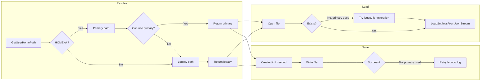

# Specification: Settings.json in User HOME Subfolder (.FindHelper)

**Feature:** Store `settings.json` in a subfolder (e.g. `.FindHelper`) under the user HOME directory, with the current location kept as a failsafe.

**Date:** 2026-02-20  
**Status:** Draft  
**References:** `specs/SPECIFICATION_DRIVEN_DEVELOPMENT_PROMPT.md`, `AGENTS.md`, `internal-docs/prompts/AGENT_STRICT_CONSTRAINTS.md`

---

## Step 1 — Requirements summary and assumptions

### Scope

- **Primary location:** `{USER_HOME}/.FindHelper/settings.json`
  - Windows: `%USERPROFILE%\.FindHelper\settings.json`
  - macOS/Linux: `$HOME/.FindHelper/settings.json`
- **Failsafe:** If the primary location cannot be used (HOME not available, directory not writable, etc.), fall back to the **current** behavior:
  - Windows: next to the executable (from `GetModuleFileNameA`), or `settings.json` in CWD if that fails.
  - Non-Windows: `settings.json` in current working directory.
- **Migration:** On first run with the new logic, if no file exists at the primary path but a file exists at the legacy path, **load from legacy** and **save to primary** so settings are migrated. Optionally log that migration occurred.
- **Test mode:** When `test_settings::IsInMemoryMode()` is active, path resolution is not used; behavior unchanged.

### Assumptions

- Reuse existing `GetUserHomePath()` from `PathUtils` (Windows: USERPROFILE, macOS/Linux: HOME) and `JoinPath` for building paths.
- Subfolder name is fixed (e.g. `.FindHelper`); no user-configurable config directory in this feature.
- Single settings file per user; no multi-profile or portable-mode requirement.
- C++17 only; use `std::filesystem::create_directories` (C++17) or existing project pattern for creating the directory.
- No change to the JSON schema or to Load/Save logic beyond the path used; only the path source changes.

### Edge cases to address in design and tests

| # | Edge case | Requirement |
|---|-----------|-------------|
| E1 | HOME / USERPROFILE not set or empty | Fall back to legacy path; log once. |
| E2 | HOME path not readable or not a directory | Fall back to legacy path; log. |
| E3 | .FindHelper does not exist | Create it before first save (and optionally before first read if we ever write there first). Use create_directories; if creation fails, fall back to legacy. |
| E4 | .FindHelper exists but is not writable (e.g. file) | Fall back to legacy path; log. |
| E5 | Legacy file exists, primary does not (first run after upgrade) | Load from legacy; save to primary (migration); do not delete legacy file in this feature (failsafe). |
| E6 | Both primary and legacy exist | Prefer **primary** for read; always **write to primary** when primary is usable, otherwise write to legacy. |
| E7 | Path length (e.g. Windows MAX_PATH) | If built path is too long or CreateDirectory/open fails due to path length, fall back to legacy. |
| E8 | Read-only filesystem for HOME or .FindHelper | Save fails to primary; fall back to legacy for save; log. |
| E9 | Concurrent runs (two instances) | No locking requirement in this spec; last write wins. Document if needed. |
| E10 | Symbolic links or network HOME | Use path as returned by GetUserHomePath(); no special handling. |
| E11 | Test / in-memory mode | GetSettingsFilePath() not called for load/save when in-memory; path logic not exercised. |

---

## Step 2 — User stories (Gherkin)

| ID | Priority | Summary | Gherkin |
|----|----------|---------|---------|
| S1 | P0 | Use primary path when HOME is available and writable | **Given** the user's HOME (or USERPROFILE on Windows) is set and writable, **When** the app loads or saves settings, **Then** it uses `{HOME}/.FindHelper/settings.json` and creates `.FindHelper` if missing. |
| S2 | P0 | Failsafe when HOME is unavailable | **Given** HOME/USERPROFILE is unset or empty, **When** the app resolves the settings path, **Then** it uses the legacy path (next to executable on Windows, CWD on macOS/Linux) and logs that the primary path was skipped. |
| S3 | P0 | Failsafe when primary directory cannot be created or used | **Given** HOME is set but `.FindHelper` cannot be created or is not writable, **When** the app saves settings, **Then** it falls back to the legacy path and logs. |
| S4 | P0 | Migrate from legacy to primary on first run | **Given** no file at primary path and a valid file at legacy path, **When** the app loads settings, **Then** it loads from legacy, then saves to primary so future runs use primary, and logs migration. |
| S5 | P1 | Prefer primary when both files exist | **Given** both primary and legacy settings files exist, **When** the app loads settings, **Then** it loads from the primary path. **And** when saving, it writes to the primary path when usable. |
| S6 | P1 | Save fallback when primary write fails | **Given** primary path was used for read but write to primary fails (e.g. disk full, permissions changed), **When** the app saves settings, **Then** it attempts save to legacy path and logs. |
| S7 | P2 | Test mode unchanged | **Given** in-memory test mode is active, **When** LoadSettings or SaveSettings is called, **Then** no file path is used and behavior is unchanged. |
| S8 | P2 | No regression when no legacy file exists | **Given** no settings file at primary or legacy, **When** the app loads settings, **Then** defaults are used; **and when** it saves, **Then** the file is created at primary (or legacy if primary unusable). |

---

## Step 3 — Architecture overview

### High-level design

- **Path resolution** is centralized in a single function (or a small set) that returns the effective settings file path for this run. That function:
  - Returns primary path `{GetUserHomePath()}/.FindHelper/settings.json` when HOME is available and the directory exists or can be created and is writable.
  - Otherwise returns the legacy path (current behavior: Windows exe-dir or CWD, else CWD).
- **Load:** Open file at resolved path; if missing, for migration only try legacy path when primary was chosen but file not found; merge no semantics (use one source). Use existing `LoadSettingsFromJsonStream` and validation.
- **Save:** Ensure directory exists for the chosen path (create `.FindHelper` when using primary); write to chosen path. If write fails and we had used primary, retry with legacy path once and log.
- **Single responsibility:** One component resolves path (and decides primary vs legacy); Load/Save use that path and existing load/save logic.

### Components and data flow

- **PathUtils:** Already provides `GetUserHomePath()` and `JoinPath()`; use them. Do not change code inside `#ifdef _WIN32` / `#ifdef __APPLE__` / `#ifdef __linux__` to “unify” behavior; implement platform-agnostic “get primary path” / “get legacy path” that call into existing platform-specific GetUserHomePath and existing legacy logic.
- **Directory creation:** Use `std::filesystem::create_directories` (C++17) for `.FindHelper` when saving to primary, or reuse an existing project helper (e.g. Logger’s CreateDirectoryIfNeeded pattern) if the project prefers not to add `<filesystem>` in Settings. Prefer one shared approach (DRY).
- **Threading:** Path resolution and load/save are on the main thread; no new threads. No locking added in this feature.

### Invariants

- After `LoadSettings`, `out` is always in a valid state (defaults or loaded values, validated).
- After `SaveSettings`, if the function returns true, the written file is the same as what would be read by `LoadSettings` at the same path.
- When `test_settings::IsInMemoryMode()` is true, path resolution is not invoked for load/save.

---

## Step 4 — Acceptance criteria

| Story | Criterion | Measurable check |
|-------|-----------|------------------|
| S1 | Primary path used when HOME is set and writable | Unit test: mock or set HOME; resolve path; path equals `{HOME}/.FindHelper/settings.json`; save creates file there. |
| S2 | Failsafe when HOME unset | Unit test: unset HOME (or use empty); resolve path equals legacy; log contains indication of fallback. |
| S3 | Failsafe when .FindHelper not writable | Unit test or integration: HOME set but .FindHelper is a file or permission denied; resolve or save falls back to legacy; log. |
| S4 | Migration from legacy to primary | Unit test: legacy file exists, primary does not; load returns legacy content; after save, primary file exists and content matches. |
| S5 | Both exist → prefer primary | Unit test: both files exist; load reads from primary path. |
| S6 | Save fallback on primary write failure | Test: primary path used but write fails; save retries legacy and succeeds or logs. |
| S7 | Test mode unchanged | Existing SettingsTests still pass; in-memory mode never calls path resolution for load/save. |
| S8 | No file → defaults, save creates at primary | Unit test: no files; load returns defaults; save creates primary (or legacy if primary unusable). |
| — | No new Sonar/clang-tidy violations | Run clang-tidy and Sonar on changed files; fix or align style (in-class init, const ref, no `} if (` on one line). |
| — | No duplication of path logic | Single place computes primary path; single place computes legacy path; reused from PathUtils where applicable. |
| — | Constants DRY | Subfolder name (e.g. `.FindHelper`) and any path constants defined once (e.g. in Settings.cpp anonymous namespace or shared constants header). |

---

## Step 5 — Task breakdown

| Phase | Task | Dependencies | Est. (h) | Notes |
|-------|------|--------------|----------|------|
| 1 | Define primary path helper: `{GetUserHomePath()}/.FindHelper/settings.json`; use PathUtils; handle empty HOME. | None | 0.5 | C++17; platform blocks stay as-is; add `#endif` comments. |
| 2 | Define legacy path helper (extract current GetSettingsFilePath logic into “legacy” path). | None | 0.5 | Keep Windows exe-dir and non-Windows CWD behavior. |
| 3 | Implement “resolve settings path”: try primary (check/create dir, writable); else return legacy. Add logging for fallback. | Phase 1, 2 | 1 | Consider create_directories only on save path to avoid touching fs on read. |
| 4 | Load: use resolved path; if primary chosen but file missing, try legacy once (migration), then load from that stream. | Phase 3 | 0.5 | Reuse LoadSettingsFromJsonStream. |
| 5 | Save: ensure directory for resolved path (create .FindHelper when primary); on write failure with primary, retry legacy and log. | Phase 3 | 0.5 | |
| 6 | Unit tests: primary used when HOME set; legacy when HOME unset; migration (legacy → primary); both exist → primary; test mode unchanged. | Phase 4, 5 | 1.5 | Use test_settings and/or temp dirs; avoid leaving files in repo. |
| 7 | Update Settings.cpp file header comment (storage locations). | Phase 3 | 0.25 | Align with actual behavior. |
| 8 | Run `scripts/build_tests_macos.sh` on macOS; fix any regressions. | Phase 6 | 0.5 | |
| 9 | Review: production checklist, no new Sonar/clang-tidy, DRY, platform rules. | Phase 8 | 0.25 | |

**Total (rough):** ~5.5 h.

---

## Step 6 — Risks and mitigations

| Risk | Impact | Mitigation |
|------|--------|------------|
| HOME/USERPROFILE behavior differs by OS or environment | Wrong path or unnecessary fallback | Rely on existing GetUserHomePath(); add tests per platform or with env override. |
| create_directories or legacy path differs on Windows vs Unix | Build or runtime failure on one platform | Keep platform blocks; use existing PathUtils and legacy logic; run tests on macOS; document Windows manual check. |
| Migration overwrites or confuses user if both paths exist | Data loss or wrong file used | Prefer primary for read when both exist; migrate only when primary file missing and legacy exists; do not delete legacy in this feature. |
| Path length (e.g. MAX_PATH on Windows) | Fallback not triggered | If create_directories or open fails, treat as “primary unusable” and fall back to legacy; log. |
| Scope creep (e.g. portable mode, multiple profiles) | Delayed delivery | Out of scope; document in spec; implement only primary + failsafe + migration. |

---

## Step 7 — Validation and handoff

### Review checklist (aligned with production)

- [ ] No new SonarQube or clang-tidy violations; preferred style (in-class init, const ref, no `} if (` on one line).
- [ ] No changes inside platform `#ifdef` blocks that alter platform intent; only new or refactored path logic.
- [ ] No extra allocations in hot paths; path resolution is once per load/save.
- [ ] No new duplication; subfolder name and path logic in one place; reuse PathUtils.
- [ ] Exception handling: path resolution and create_directories wrapped; specific catches; log and fallback.
- [ ] Naming: `docs/standards/CXX17_NAMING_CONVENTIONS.md`.
- [ ] Tests: SettingsTests and new path/migration tests pass; `scripts/build_tests_macos.sh` on macOS.

### Using this spec with Cursor Agent/Composer

1. Use this document as the single source of truth for the feature.
2. In the task prompt, reference `AGENTS.md` and `internal-docs/prompts/AGENT_STRICT_CONSTRAINTS.md` and paste the **Strict Constraints / Rules to Follow** block from `AGENT_STRICT_CONSTRAINTS.md` (or the one-line reminder).
3. Implement in the order of the task breakdown (Phase 1 → 9).
4. Run `scripts/build_tests_macos.sh` on macOS after C++ changes.
5. Verify no new Sonar/clang-tidy issues on changed files.

### Strict constraints (reminder)

Include the following in the implementation prompt so the agent respects project rules:

- Do not introduce new SonarQube or clang-tidy violations; fix the cause first; use `// NOSONAR` only on the same line if unavoidable.
- Apply preferred style so both tools are satisfied: in-class initializers for default members, `const T&` for read-only parameters, no `} if (` on one line (use new line or `else if`).
- No performance regressions (no extra allocations in hot paths); no duplication (extract and reuse).
- Do not change code inside platform `#ifdef` blocks to make it “cross-platform”; use platform-agnostic abstraction with separate implementations.
- Use `(std::min)` / `(std::max)` and explicit lambda captures in templates on Windows.
- All `#include` at top of file; lowercase `<windows.h>`.
- Do not run build commands unless the task explicitly requires it; use `scripts/build_tests_macos.sh` on macOS for tests.

---

## Summary

| Item | Decision |
|------|----------|
| Primary path | `{GetUserHomePath()}/.FindHelper/settings.json` |
| Failsafe | Current behavior: Windows exe-dir or CWD; macOS/Linux CWD |
| Migration | Load from legacy when primary missing and legacy exists; then save to primary |
| Directory creation | Create `.FindHelper` when saving to primary (e.g. `std::filesystem::create_directories`) |
| Test mode | Unchanged; path not used when in-memory |
| Edge cases | E1–E11 covered in Step 1 and stories S1–S8 |
